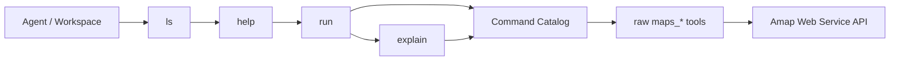

[](https://mseep.ai/app/sugarforever/amap-mcp-server)

# 高德地图 MCP Server

面向 agent 的高德地图 MCP facade。这个仓库不是简单罗列高德 Web Service raw API，而是把地理编码、POI、天气、路线规划等能力收口成更适合 agent loop 消费的命令面。

该项目发布在 [PyPI](https://pypi.org/project/amap-mcp-server/)。

<a href="https://glama.ai/mcp/servers/@sugarforever/amap-mcp-server">
  
</a>

## Overview



默认主路径：

- 先用 `ls` 发现 command / resource / action
- 再用 `help` 查看参数、示例、cites 和 acceptance hint
- 真正执行统一走 `run`
- 失败后把错误文本喂给 `explain`

raw `maps_*` 工具仍然保留用于兼容与调试，但对新的 agent 场景，推荐优先使用 facade：`ls / help / run / explain`。

## Why This Repo

这个仓库在工作区里的定位是 Amap / LBS 能力真源，重点服务于类似 `anyagent-apps/examples/trip-planner-workspace` 这样的上层 agent 场景。也就是说，文档和工具面要能支撑一条完整闭环：

1. 发现能做什么
2. 选择合适的 action
3. 成功执行并拿到稳定结构
4. 失败时知道下一步怎么排查
5. 从高层 target 反查到底层 raw tool、实现位置和验收命令

## Quick Start

### 1. 准备 API Key

```bash
export AMAP_MAPS_API_KEY=your_amap_maps_api_key
```

### 2. 本地直接运行 MCP Server

```bash
uv run --project /Users/ticoag/Documents/myws/clawers/workspace/amap-mcp-server \
  amap-mcp-server serve stdio
```

三种传输模式都作为标准入口显式支持：

```bash
uv run --project /Users/ticoag/Documents/myws/clawers/workspace/amap-mcp-server \
  amap-mcp-server serve sse --host 0.0.0.0 --port 8000
uv run --project /Users/ticoag/Documents/myws/clawers/workspace/amap-mcp-server \
  amap-mcp-server serve streamable-http
```

如果要改 HTTP 端点，还可以显式传：

- `--host`
- `--port`
- `--mount-path`
- `--sse-path`
- `--message-path`
- `--streamable-http-path`

### 3. 在 agent 接入前先看目录和帮助

```bash
uv run --project . amap-mcp-server docs targets
uv run --project . amap-mcp-server docs show route.driving.plan --format markdown
uv run --project . amap-mcp-server docs runtime
uv run --project . amap-mcp-server smoke list
```

## MCP Client Config

### stdio

```json
{
  "mcpServers": {
    "amap-mcp-server": {
      "command": "uvx",
      "args": ["amap-mcp-server"],
      "env": {
        "AMAP_MAPS_API_KEY": "your valid amap maps api key"
      }
    }
  }
}
```

### SSE

```bash
export AMAP_MAPS_API_KEY=你的有效API Key
uvx amap-mcp-server serve sse --host 0.0.0.0 --port 8000
```

```json
{
  "mcpServers": {
    "amap-mcp-server": {
      "url": "http://0.0.0.0:8000/sse"
    }
  }
}
```

### Streamable HTTP

```bash
export AMAP_MAPS_API_KEY=你的有效API Key
uvx amap-mcp-server serve streamable-http --host 0.0.0.0 --port 8000
```

```json
{
  "mcpServers": {
    "amap-mcp-server": {
      "url": "http://localhost:8000/mcp"
    }
  }
}
```

## Command Surface

当前 facade 覆盖这些稳定 target：

- `geo.address.resolve`
- `geo.location.reverse`
- `geo.ip.locate`
- `weather.city.get`
- `poi.keyword.search`
- `poi.around.search`
- `poi.place.detail`
- `route.bicycling.plan`
- `route.walking.plan`
- `route.driving.plan`
- `route.transit.plan`
- `route.distance.measure`

完整参数、示例、cite 与 acceptance hint 见：

- [docs/reference/commands.md](/Users/ticoag/Documents/myws/clawers/workspace/amap-mcp-server/docs/reference/commands.md)

## Transport Surface

参考 `lark-openapi-mcp` 的 transport 设计，这里把 stdio、sse、streamable-http 都作为一等能力面暴露，而不是只把 HTTP 模式当附带功能。

| Mode | 适用场景 | 启动方式 | 默认端点 |
|---|---|---|---|
| `stdio` | Cursor / Claude / 本地 agent 客户端集成 | `amap-mcp-server serve stdio` | 无 |
| `sse` | 需要基于 SSE 暴露 MCP 服务 | `amap-mcp-server serve sse --host 0.0.0.0 --port 8000` | `/sse` |
| `streamable-http` | 需要标准 HTTP MCP 端点 | `amap-mcp-server serve streamable-http --host 0.0.0.0 --port 8000` | `/mcp` |

## Docs Map

- 架构与设计动机：[docs/architecture/agent-facing-surface.md](/Users/ticoag/Documents/myws/clawers/workspace/amap-mcp-server/docs/architecture/agent-facing-surface.md)
- facade / federation 分层决策：[docs/architecture/facade-vs-federation.md](/Users/ticoag/Documents/myws/clawers/workspace/amap-mcp-server/docs/architecture/facade-vs-federation.md)
- v2 迁移 TODO：[docs/architecture/v2-migration-todo.md](/Users/ticoag/Documents/myws/clawers/workspace/amap-mcp-server/docs/architecture/v2-migration-todo.md)
- facade 命令参考：[docs/reference/commands.md](/Users/ticoag/Documents/myws/clawers/workspace/amap-mcp-server/docs/reference/commands.md)
- raw tools 对照：[docs/reference/raw-tools.md](/Users/ticoag/Documents/myws/clawers/workspace/amap-mcp-server/docs/reference/raw-tools.md)
- 常见错误与排障：[docs/reference/errors.md](/Users/ticoag/Documents/myws/clawers/workspace/amap-mcp-server/docs/reference/errors.md)
- 验收与 smoke：[docs/acceptance/README.md](/Users/ticoag/Documents/myws/clawers/workspace/amap-mcp-server/docs/acceptance/README.md)

## Official MCP References

- MCP 官方仓库：`https://github.com/modelcontextprotocol/python-sdk`
- MCP Python SDK v2 参考：`https://github.com/modelcontextprotocol/python-sdk/blob/main/README.v2.md`

## Raw Tools

以下 raw `maps_*` 工具继续保留，用于兼容现有客户端和底层调试：

- `maps_geo`
- `maps_regeocode`
- `maps_ip_location`
- `maps_weather`
- `maps_text_search`
- `maps_around_search`
- `maps_search_detail`
- `maps_distance`
- `maps_bicycling_by_address`
- `maps_bicycling_by_coordinates`
- `maps_direction_walking_by_address`
- `maps_direction_walking_by_coordinates`
- `maps_direction_driving_by_address`
- `maps_direction_driving_by_coordinates`
- `maps_direction_transit_integrated_by_address`
- `maps_direction_transit_integrated_by_coordinates`

默认不建议新场景直接从 raw tools 起步。更推荐先围绕 facade 设计，再在需要排障或兼容时回到 raw tools。

## Development Notes

- `AMAP_MAPS_API_KEY` 现在按请求读取，因此即使当前 shell 没有 key，也可以先执行 `docs targets`、`docs show`、`docs export` 这类只读命令。
- facade 的单一事实来源是 `amap_mcp_server.server.COMMAND_ACTIONS`。
- 如果增加新的高德能力，优先补全 command catalog，再同步 raw tool、README、reference 和 acceptance。
- 迁移方向以官方 MCP Python SDK v2 为准，不再保留旧 server 设计兼容层。
- 当前代码已经开始做 runtime 解耦；待官方 v2 runtime 可直接安装后，应优先替换 `amap_mcp_server/mcp_runtime.py`，而不是回头扩展旧运行时习惯。

您可以在[高德开放平台](https://lbs.amap.com/)注册并获取 API 密钥。
