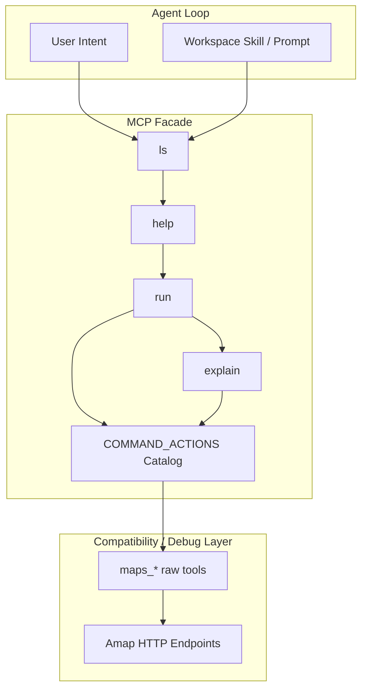

# Agent-Facing Surface

## Overview

`amap-mcp-server` 的目标不是把高德 Web Service 原样暴露给 agent，而是提供一层 agent-friendly facade，让上层 workflow 可以先发现、再理解、再执行、再排障。

仓库级分工上，本仓明确站在 **facade** 这一层；`anyagent` 负责 federation，不负责高德领域命令层。相关设计决策见 [facade-vs-federation.md](/Users/ticoag/Documents/myws/clawers/workspace/amap-mcp-server/docs/architecture/facade-vs-federation.md)。

这层 facade 的设计直接遵循工作区里的三条原则：

- `Everything Reach-able`
- `Gradual Disclosure`
- `Cite Bidirectional Linking`

## Layering

## Why Facade First

直接暴露 raw tools 的问题：

- agent 很难从十几个 `maps_*` 名称直接推断“哪个才是主路径”
- 地址版和坐标版工具会把选择成本推给上层
- 错误提示和排障路径分散在实现细节里

facade 的作用是把这些决策往下收口：

- `ls` 负责发现能力边界
- `help` 负责给最小可行动信息
- `run` 负责统一返回结构
- `explain` 负责错误解释和下一步建议

## Single Source of Truth

facade 的命令定义、示例、cite、acceptance hint 统一来自：

- `amap_mcp_server/server.py::COMMAND_ACTIONS`

这份 catalog 同时服务于：

- MCP facade tools
- CLI `docs *`
- CLI `smoke *`
- `docs/reference/commands.md`

当前 runtime 注册已经从命令面逻辑中拆分出来，迁移目标是让后续切官方 MCP Python SDK v2 时只需要替换 runtime adapter，而不是重写高德领域逻辑。

目前这个“往 v2 靠”的设计锚点，体现在代码结构而不是运行日志：

- `RuntimeAdapter` 是稳定接口
- `FastMCPRuntimeAdapter` 只是当前实现
- 未来切官方 v2 时，应优先替换 adapter，而不是侵入 facade 命令面

## Transport Design

参考 `lark-openapi-mcp` 的思路，以及官方 MCP Python SDK v2 的 server 设计，transport 本身也是能力面的一部分，而不是只在 README 末尾补一句“也支持 HTTP”。

当前约束：

- `stdio` 是默认推荐模式，适合本地 MCP client 和 agent workspace 集成
- `sse` 与 `streamable-http` 都必须是一等支持模式
- transport 选择统一通过 `serve <mode>` 进入，不再额外保留 transport 简写兼容层
- HTTP 模式需要显式暴露 host / port / path，而不是把这些细节埋在实现默认值里
- 后续 server 实现以官方 MCP Python SDK v2 的入口模型为准，不再围绕旧 FastMCP 习惯做兼容

这能让上层在 workspace、容器部署、远程调试三种场景下使用同一套心智模型：

- 先决定 transport
- 再确定 endpoint
- 再进入 facade `ls/help/run/explain`

## Reachability Checklist

对每一个 target，都应该能回答：

1. 用户或 agent 怎么先发现它
2. 它适合什么场景
3. 它要求哪些参数
4. 它底层映射到哪些 raw tools
5. 它的实现落在哪
6. 它最小怎么验收

如果其中任一点只能靠“搜源码”才能知道，这一层设计就还没完成。
