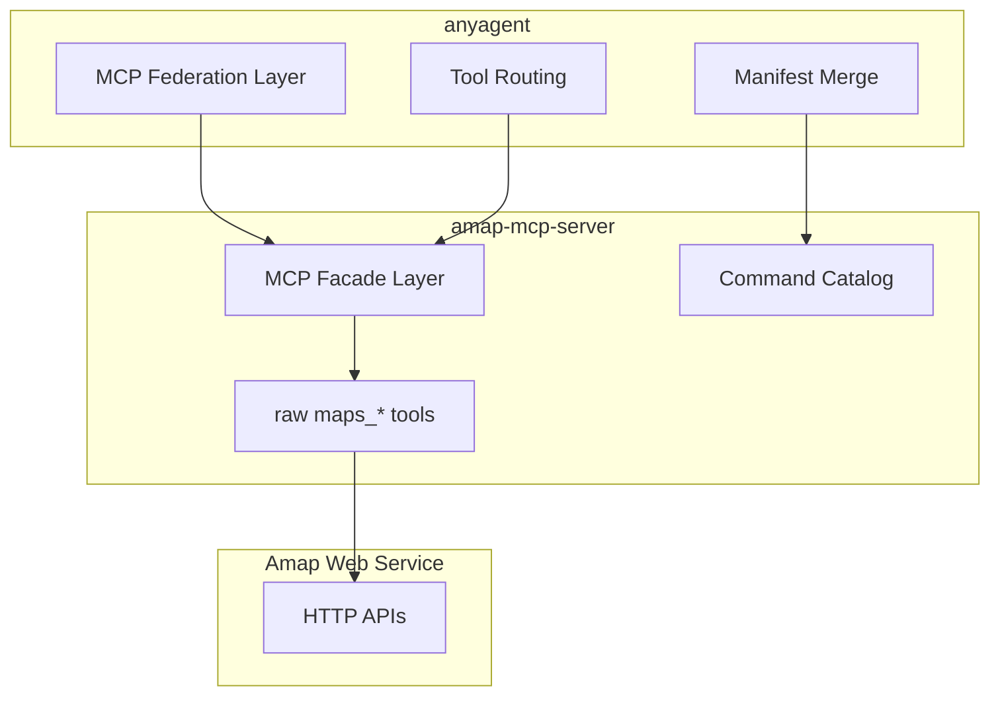

# Facade vs Federation

## Overview

本仓库后续改造遵循一个明确分层：

- `anyagent` 负责 **MCP federation**
- `amap-mcp-server` 负责 **MCP facade**

这不是两个互斥方向，而是上下两层职责。

## Why This Split

### `anyagent` should stay federation-first

`anyagent` 是工作区里的基础设施层，职责是：

- 读取 `mcp.json`
- 按 transport 连接 MCP server
- 列出远端工具并并入 agent manifest
- 按 `mcp.<label>.<tool>` 路由工具调用

它不应该替所有领域 server 重新定义命令层语义，否则会把高德、飞书、GitHub、文件系统这类完全不同的能力面强行揉成一层假的统一抽象。

### `amap-mcp-server` should be facade-first

高德地图能力是强领域模型：

- 地址解析与路线规划存在多步推理
- 地址版 / 坐标版工具有选择成本
- 错误恢复经常需要结合场景给下一步建议
- 上层 trip-planner 更需要“如何发现 / 如何解释 / 如何排障”，而不是仅仅“工具能调用”

因此这里应该把高德原始能力收口成稳定的 facade：

- `ls`
- `help`
- `run`
- `explain`

## Relationship Diagram

## Design Principles

### 1. Facade lives in the MCP server, not in the client integrator

`anyagent` 不再为 Amap 额外发明命令层。Amap 的命令层、帮助系统、cite、错误解释都由 `amap-mcp-server` 自己提供。

### 2. Federation stays thin

`anyagent` 只负责：

- 传输连接
- manifest 合并
- 工具调用路由
- 凭证注入与生命周期管理

它不承担高德领域知识。

### 3. Facade must remain traceable

每个 facade target 都必须能追到：

- raw tool
- Amap 官方文档
- 实现位置
- 最小验收命令

## Official MCP v2 Direction

后续改造以官方 MCP Python SDK v2 的 server 设计为准，不再为旧 FastMCP 风格保留兼容层。

官方参考：

- MCP 官方仓库：`https://github.com/modelcontextprotocol/python-sdk`
- MCP Python SDK v2：`https://github.com/modelcontextprotocol/python-sdk/blob/main/README.v2.md`

这意味着：

- transport 名称与行为以官方 v2 为准
- server 入口和运行方式以官方 v2 为准
- 本仓只做适配，不再维护“双入口 / 双设计”

## Current Status

截至 2026-03-12，本仓已经进入 **v2-ready 重构阶段**：

- 文档与设计决策已经切到官方 v2 方向
- 业务逻辑与 MCP runtime 注册已经开始解耦
- runtime 已抽成明确 adapter 接口，后续切 v2 时以替换 adapter 为主
- 但官方 `README.v2.md` 对应的 `MCPServer` 运行时目前仍未通过当前可访问的分发源直接拿到

因此当前实现策略是：

- 不再扩展旧设计的兼容面
- 先把代码结构收敛成“runtime 可替换”
- 待官方 v2 runtime 可直接消费后，再替换 runtime adapter

## Migration Rule

做迁移时遵循以下顺序：

1. 先固定文档与架构决策
2. 再切依赖与 server 实现
3. 最后更新 acceptance 与上游 workspace 配置

如果依赖源不可达，优先保留文档决策与代码结构重组，不要为了暂时可跑而重新引入旧设计兼容层。
